# Nvidia Jetson Nano

Nvidia Jetson Nano es una placa de computación integrada desarrollada por Nvidia, diseñada para su uso en sistemas de IA pequeños enfocados a la eficiencia energética.

<!-- If you're reading this, you're a nerd like me. Go play Ultrakill -->

<p align="center" width="100%">
    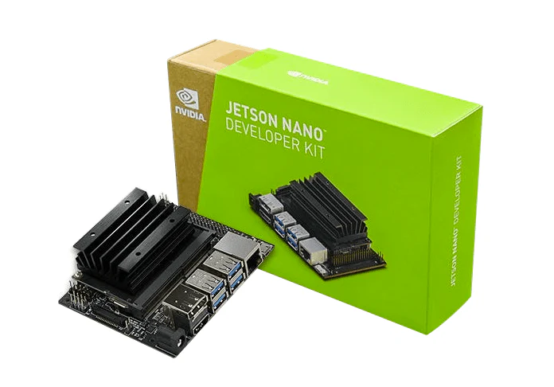
</p>

**ATENCIÓN:** Para poder utilizar la Jetson Nano, es necesario contar con una pantalla con conexión HDMI, un teclado y ratón con conexión USB y una tarjeta MicroSD con mínimo 32 GB de espacio UHS-I.

<!-- Disclaimer: Not a single comment found in this README is of any use for the Nvidia Jetson Nano, just random stuff -->

## Setup hardware

Este apartado mostrará como conectar todo el hardware adicional requerido por la Jetson Nano. Como se menciona previamente, para poder utilizar la Jetson Nano serán necesarios una serie de elementos hardware adicionales que no se encuentran incluidos en el Developer Kit proporcionado. Estos elementos son:

  - Una **pantalla**, con conexión HDMI o DisplayPort (DP)
  - Un **teclado**, con conexión USB 3.0
  - Un **ratón**, con conexión USB 3.0
  - Una **tarjeta MicroSD UHS-I**, inicialmente vacía con al menos 32 GB de espacio disponible
  - Un **adaptador de corriente 5V-2A** con cable **Micro-USB**.

Para la realización de este proyecto, se supondra que cuenta con un **ordenador adicional** donde podrá descargar la imagen de Nvidia para la Jetson y comenzar el setup software. Adicionalmente, se considerará que posee los siguientes elementos, no indicados en la descripción de Nvidia, pero necesarios para poder realizar el setup correcto del sistema.

  - Adaptador MicroSD a USB 3.0
  - Cable HDMI o DP, dependiendo de la conexión utilizada

La siguiente imagen mostrará las conexiones de los distintos elementos hardware planteados para poder comenzar el setup software de la Jetson Nano. Por favor, realice las conexiones de la pantalla, el ratón, el teclado para permitir interactuar con la placa y el adaptador de corriente para suministrarle energía.

<p align="center" width="100%">
    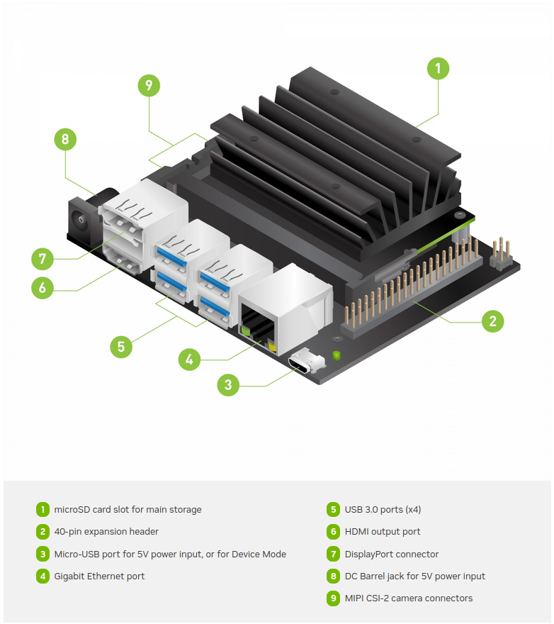
</p>
 
Toda la información sobre las conexiones se puede leer detenidamente en la Guía de Inicio de NVIDIA para la Jetson Nano, que se puede encontrar <a href="https://developer.nvidia.com/embedded/learn/get-started-jetson-nano-devkit#intro" target="_blank" rel="noreferrer">aqui</a>.

Una vez estas conexiones estén realizadas, podemos pasar al apartado de setup software, que comenzará en el ordenador adicional previamente mencionado.

## Setup software

Este apartado se centrará en la instalación y puesta a punto del software requerido por la Jetson Nano.

### Setup previo en ordenador adicional

Para ello, el primer paso necesario es instalar la imagen 
<a href="https://developer.nvidia.com/jetson-nano-sd-card-image" target="_blank" rel="noreferrer">Jetson Nano Developer Kit SD Card Image</a>.

A continuación, los pasos tomados dependen del sistema operativo utilizado en el ordenador adicional. El caso que se va a mostrar a continuación es el necesario para sistemas **Linux**. Si su ordenador difiere de sistema operativo, siga las instrucciones descritas <a href="https://developer.nvidia.com/embedded/learn/get-started-jetson-nano-devkit#write" target="_blank" rel="noreferrer">aqui</a>.

Para sistemas operativos **Linux**, se utilizará Balena-Etcher para montar la imagen descargada previamente en la tarjeta MicroSD. Para ello, descargaremos el paquete Debian directamente de su repositorio Github. Por temas de eficiencia, el paquete se puede descargar directamente <a href="https://github.com/balena-io/etcher/releases/download/v1.19.21/balena-etcher_1.19.21_amd64.deb" target="_blank" rel="noreferrer">aqui</a>.

Una vez descargado, abrimos una terminal con el shortcut ```Ctrl + Alt + T```.

En esta terminal, escribiremos los siguientes comandos, que se encargarán de instalar el software descargado en forma de paquete.

```
# Move to Downloads folder where Debian Package is
cd Downloads

# Install Debian package with APT
sudo apt install ./balena-etcher_1.19.21_amd64.deb
```

Una vez esta instalación termine, podemos comprobar que se encuentre bien instalado ejecutando el programa. En la misma terminal, escribimos:

```
balena-etcher
```

Este comando ejecutará el software, que se abrirá en una ventana como esta.

<p align="center" width="100%">
    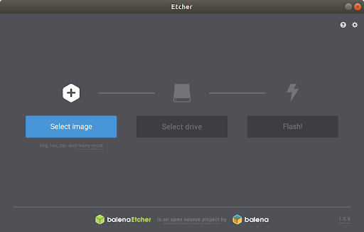
</p>

Una vez esta ventana esta abierta, conectaremos el adaptador MicroSD a USB con la tarjeta MicroSD insertada en uno de los puertos USB del ordenador adicional. Si este es el único dispositivo de memoria externo, Etcher debería reconocerlo automáticamente y seleccionarlo como *drive*. Si no lo hace, deje el adaptador conectado y reinicie Etcher.

Para seleccionar la imagen, haga click en *Select Image* y seleccione el archivo .zip descargado previamente del enlace dado.

<<a href="https://developer.nvidia.com/jetson-nano-sd-card-image" target="_blank" rel="noreferrer">Jetson Nano Developer Kit SD Card Image</a>> Por si alguien no se lo habia descargado.

<p align="center" width="100%">
    
</p>

Una vez todo se encuentre en orden, como se muestra en la imagen previa, haga click en *Flash!*, introduzca la contraseña del usuario y espere. Este proceso suele llevar entre 15~20 minutos.

En cuanto termine este proceso, **POR SEGURIDAD** primero expulse el adaptador con la tarjeta MicroSD y luego extraiga la tarjeta MicroSD del adaptador.

Introduzca esta tarjeta en la ranura de la Jetson Nano, por el lado contrario a las conexiones previas de los periféricos, justo debajo del disipador.

<p align="center" width="100%">
    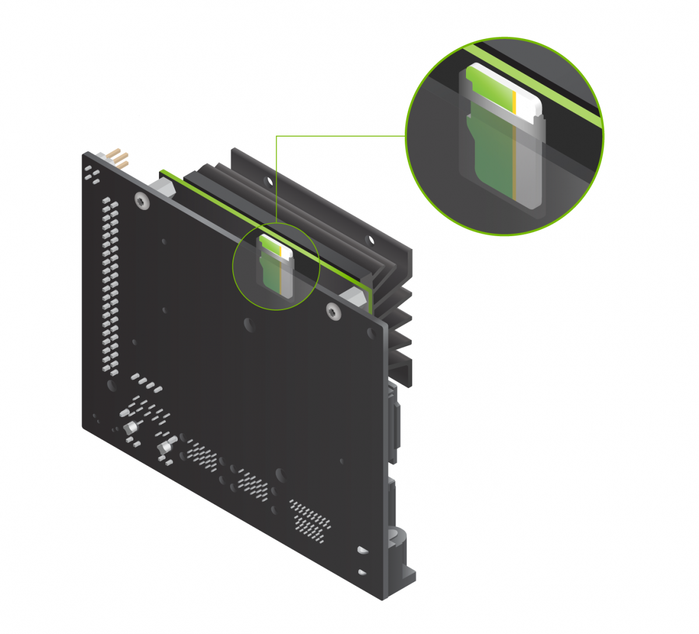
</p>stru

### ADICIONAL: Formateo en Linux

Si por alguna razon se necesita realizar un formateo de una de las tarjetas SD, se puede realizar en Linux mediante los siguientes comandos.

<p align="center" width="100%">
    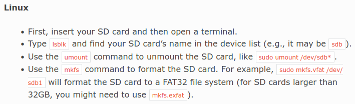
</p>

### Setup posterior en Jetson Nano

Con todos los periféricos conectados y la tarjeta MicroSD con la imagen de Nvidia introducida, se puede pasar a trabajar sobre la Jetson Nano.

Lo primero que se debe hacer es completar la configuración del equipo. Tras aceptar los terminos de la licencia y elegir el idioma en el que quiere trabajar, puede elegir el layout del teclado. Tenga cuidado porque esto no es lo mismo que el idioma, sino la disposición de teclas. En este caso, como estamos utilizando teclados españoles (tienen ñ), seleccionaremos "Español" como layout del teclado. 

El idioma seleccionado se encuentra a su discreción y comodidad, pero yo he elegido inglés.

Tras esto, es necesario crear el usuario. Los datos de login los dejo a su discreción. En caso de que alguna Jetson Nano se encuentre inicializada a mi nombre, los datos de acceso son los siguientes:

- Name: brais
- Computer's name: brais-jetsonnano
- Username: brais
- Password: citius

Para el apartado de APP Partition Size, dejaremos el tamaño de partición que viene por defecto (normalmente 60859). 

Finalmente, para Nvpmodel Mode, tambien se dejará por defecto, que tendría que ser "MAXN - (Default)". Tras darle a continuar, el sistema se encargará de aplicar la configuración y los cambios realizados.

Tras terminar la configuración, la Jetson Nano pedirá de nuevo la contraseña para iniciar sesión. Una vez dentro, si esperamos un poco, el sistema pedirá un reinicio para establecer la configuración definitiva, por lo que abrimos una terminal con ```Ctrl + Alt + T``` y escribimos el comando ```reboot```.

## Configuración de red

**ATENCIÓN:** Las instrucciones presentes a continuación requieren de cierto conocimiento sobre el funcionamiento de las interfaces de red. Si duda o carece de dicho conocimiento, pida ayuda al personal de la ICT Infrastructure Management Unit del CITIUS.

---

#### Linux

---

A continuación, este apartado tratará la configuración de las interfaces de red para proporcionar salida a Internet a la Jetson Nano **SOLO** si está no posee capacidades de conexión en un principio.

Para comprobarlo, puede utilizar el siguiente comando:

```
# If it outputs responses without packet loss, everything is alright
ping 8.8.8.8
```

Lo primero que se debe hacer para proveer de conexión a nuestra Jetson Nano es conectarla mediante cable Ethernet a nuestro ordenador adicional. Esta conexión se puede realizar en uno de los puertos Ethernet de las tarjetas de red de nuestro ordenador si tenemos espacio o mediante un adaptador Ethernet en alguno de los puertos USB restantes.

Una vez este realizada esta conexión, podemos pasar a la Jetson Nano. Dentro de ella, abrimos una terminal con ```Ctrl + Alt + T``` y escribimos los siguientes comandos:

```
# This information can be found in the L4T-README folder on the Jetson Nano,  # specifically in the README-wifi.txt file.

# Checks that everything is up to date
sudo apt update

# Checks that NetworkManager is already installed
sudo apt install network-manager

# Starts NetworkManager if not already started
sudo service NetworkManager start
```

Una vez Network Manager este funcionando y se tenga conexión mediant cable Ethernet, aparecerá un signo de señal en la parte superior derecha de la pantalla de la Jetson Nano. Si le hacemos click, nos aparecerá un desplegable sobre el que tenemos que escoger la opción "Edit Connections".

Dentro de esta ventana, podremos ver las diferentes conexiones actuales de la Jetson Nano. Hacemos click en la conexión encontrada debajo del desplegable de Ethernet, que en mi caso se denomina "Wired Connection 1".

Al hacer click en esta "Wired Connection 1", nos abrirá una ventana de edición. En esta ventana, nos dirigimos al apartado "IPv4 Settings"

En este apartado, cambiaremos el método a "Manual" y pasaremos a añadir un address. Para ello, haremos click en el botón de "Add" e introduciremos lo siguiente en sus respectivos campos.

  - Address: 192.168.0.X (poned en X un número entre 1 y 254, yo elegi 2)
  - Netmask: 24
  - Gateway: 192.168.0.1

Finalmente, añadiremos un servidor DNS, que será "8.8.8.8". Con todo esto, guardamos cambios y cerramos todas las ventanas.

Terminado este proceso, volvemos al ordenador adicional. Podemos comprobar si se reconoce la conexión de red desde la Jetson Nano con el siguiente comando.

```
# Shows network interfaces
ip addr sh
```

Generalmente, un ordenador conectado unicamente a una única red tendrá dos interfaces básicas, ```lo``` que es la interfaz de *loopback* y ```eno1``` que es su interfaz de salida a Internet. Si todo se ha realizado correctamente, existirá una tercera interfaz con un nombre mas largo y extraño, que en mi caso es ```enxc4411e82eb28```. Esta interfaz es la de conexión con la Jetson Nano, y será sobre la que realizaremos cambios.

Para poder compartir salida a Internet desde el ordenador adicional, primero es crear y configurar una conexión compartida entre ambos equipos.

```
# Config shared connection (change interface name pls)
nmcli connection add type ethernet ifname enxc4411e82eb28 ipv4.method shared con-name jetson
```

Este comando debería de dar un output similar al siguiente.

```
Connection 'jetson' (XXXXXXXX-XXXX-XXXX-XXXX-XXXXXXXXXXXX) successfully added.
```

Ahora que tenemos la conexión añadida, debemos setearla como conexión para la interfaz de red que queremos. Para ello, primero comprobamos las interfaces de red con el siguiente comando.

```
# Check network interfaces
nmcli device
```

Este comando tendrá un output muy similar al siguiente.

<p align="center" width="100%">
    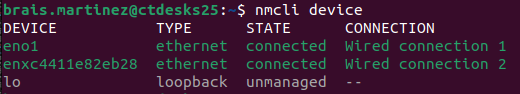
</p>

Como se puede observar, la interfaz ```enxc4411e82eb28``` no cuenta con la conexión ```jetson``` creada previamente, por lo que tendremos que cambiarla. Si tu interfaz ya se encuentra correctamente seteada con su conexión, puedes ignorar este paso.

Para setear la nueva conexión, utilizaremos el próximo comando.

```
# Starts connection
nmcli connection up jetson

# You may check the interface again with the previous command
nmcli device
```
Una vez la conexión este aplicada, podemos pasar a comprobar si la IP sobre la que se está aplicando es la correcta con el siguiente comando. Si es la correcta, puede ignorar este paso.

```
# Shows IPs of network interface
ip -o addr show enxc4411e82eb28
```

La salida será algo similar a la siguiente:

<p align="center" width="100%">
    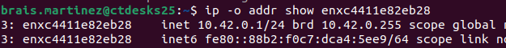
</p>

Como se puede observar, la IP presente en el primer campo no es ninguna de las seleccionadas previamente, por lo que es necesario cambiarla. Esto se puede hacer mediante los siguientes comandos.

```
# Changes IP for the connection configured
nmcli connection modify jetson ipv4.addresses 192.168.0.1/24

# Restart the connection
nmcli connection up jetson
```

Finalmente, se puede observar que todo esta correctamente configurado con los comandos previamente explicados.

```
# Check connection for the interface
nmcli device

# Check IP for the connection
ip -o addr show enxc4411e82eb28
```

Para terminar con este apartado, proceda de nuevo a la Jetson Nano y utilice el siguiente comando para comprobar si tiene conexión.

```
ping www.usc.es
```

Si la salida es la similar a la siguiente línea de texto, pese a que se pierdan todos los mensajes, la Jetson Nano ya tiene conexión.

```
PING www.usc.es (52.157.220.132) 56(84) bytes of data
```

---

#### Windows

---

**ATENCIÓN:** Estas instrucciones están planteadas para Windows 10 y 11.

Para poder compartir conexión desde Windows a la Jetson Nano, primero es necesario habilitar la conexión mediante la cual obtenemos salida a Internet para compartir dicha conexión a otros dispositivos.

Para llegar a estas opciones, utilizaremos el shortcut ```Super + X``` y seleccionaremos ```Conexiones de red```. (*Para quien no sepa que es la tecla Super, es la tecla con el símbolo de Windows*)

###### Windows 11

En mi caso (Windows 11), obtengo salida a Internet mediante una conexión Wifi, por lo que sería necesario entrar a la configuración avanzada de la red Wifi. Para ello, seleccionaremos la última opción, ```Configuración de red avanzada```. Dentro de las opciones avanzadas, desplegaremos las opciones del controlador Wifi y nos dirigiremos a ```Mas opciones de adaptador```. Esta opción abrirá una ventana que se dividirá en dos secciones, ```Funciones de red``` y ```Uso compartido```. Si carecemos de esta segunda pestaña, nos aseguraremos de que el cable Ethernet está conectado al ordenador y que el cable se encuentran en buen estado. Tras esto, nos dirigimos a ```Uso compartido``` y activamos la primera opción, que dice algo similar a ```Permitir que los usuarios de otras redes se conecten a través de la conexión a Internet de este equipo```. Si tenemos mas de un conexión extra, puede que esta opción pida una red para permitir. En este caso, deberemos poner aqui la interfaz de red que utilizará la Jetson Nano. La otra opción no importa para este caso. Es importante darle a ```Aceptar``` para guardar los cambios.

Continuando con Windows 11, ahora volveremos a las opciones de ```Red e Internet``` (podeis volver a escoger la opción desde ```Super + X```). En este punto, podemos modificar la IP de la conexión Ethernet. Para ello, lo primero es colocar la IP de modo ```Automática(DHCP)``` a modo ```Manual```. La IP que debemos poner es una IPv4 que corresponde a la salida del comando ```ip route``` ejecutado en la Jetson Nano para la interfaz ```eth0```. En mi caso, la salida del comando ```ip route``` es ```192.168.137.1```, que es la IP que añadiré a la configuración manual de la conexión Ethernet con una mascará de red ```255.255.255.0```.

Para probar la conexión, pueden usar el comando ```ping www.usc.es```. Si la salida del comando contiene una IP, la conexión funciona pese a que no saque mensajes de paquetes devueltos.

##### Windows 10

En el caso de Windows 10, podemos hacer uso de un procedimiento similar. Mediante el shortcut ```Super + X``` seleccionamos ```Conexiones de red```. Dentro de este apartado, seleccionamos el adaptador de red que tenga salida a Internet (es decir, el que estemos usando para conectarnos a Internet actualmente), en mi caso siendo un adaptador Wifi, y seleccionamos ```Propiedades```. Esta acción abrirá una ventana. Dentro de esta ventana, en el apartado de ```Uso compartido```, habilitamos la opción ```Permitir que los usuarios de otras redes se conecten a través de la conexión a Internet de este equipo```. Aceptamos los cambios para guardarlos.

Tras este paso, podemos modificar la conexión Ethernet que nos enlaza a la Jetson Nano. Para ello, lo primero es colocar la IP de modo ```Automática(DHCP)``` a modo ```Manual```. La IP que debemos poner es una IPv4 que corresponde a la salida del comando ```ip route``` ejecutado en la Jetson Nano para la interfaz ```eth0```. En mi caso, la salida del comando ```ip route``` es ```192.168.137.1```, que es la IP que añadiré a la configuración manual IPv4 de la conexión Ethernet con una mascará de red ```255.255.255.0```.

Para probar la conexión, pueden usar el comando ```ping www.usc.es```. Si la salida del comando contiene una IP, la conexión funciona pese a que no saque mensajes de paquetes devueltos.

---

#### Conectividad mediante adaptador Wifi

---

Para poder hacer uso del adaptador Wifi proporcionado, primero es necesario instalar los drivers necesarios del fabricante. Estos drivers se deben descargar directamente de la página del fabricante, por lo que es necesario establecer una **conexión Ethernet inicial** mediante alguno de los métodos previamente mencionados.

Como mención especial, los drivers para Linux **solo** son **compatibles** para versiones de **Ubuntu y Fedora**. Las instrucciones mencionadas a continuación solo servirán si el **kernel** del sistema se encuentra entre la **versión 5.11** y la **versión 4.5**.

El sistema operativo de la Jetson Nano es una versión altamente modificada de Ubuntu 18, por lo que se cumpliría este requisito. Para comprobar la versión del kernel, se puede utilizar el siguiente comando.

```
# Check kernel version
uname -r
```

Si todo es igual a como lo tengo yo, la versión del kernel será ```4.9.253-tegra```. De esta manera, podemos inferir que las instrucciones a continuación son validas para nuestro sistema operativo.

Una vez hechas las comprobaciones necesarias, podemos pasar a descargar los drivers del adaptador. Lo habitual sería ir a la página del fabricante, buscar el modelo y descargar los drivers indicados. Para evitar confusiones y agilizar el proceso, los drivers se puede instalar aqui: <a href="https://www.edimax.com/edimax/download/download/data/edimax/global/download/smb_embedded_wireless_adapter_bluetooth/ew-7611ulb_v2" target="_blank" rel="noreferrer">EW-7611ULB V2 Wifi Adapter</a>.

Una vez descargado, es necesario descomprimirlo. Para ello puede hacer uso del siguiente comando en la misma carpeta donde lo haya descargado.

```
# Unzip file in the same directory
unzip EW-7611ULB_V2_Linux_Driver_1.0.0.0.zip
```

Antes de continuar, es preciso asegurar que el sistema se encuentra actualizado para la instalación de los drivers.

```
sudo apt update

sudo apt upgrade

sudo reboot
```

Para asegurar la presencia de los modulos necesarios durante la compilación, ejecutaremos el siguiente comando.

```
# Install essential dependencies
sudo apt install build-essential make gcc
```

Ahora podemos proceder a entrar en la carpeta descomprimida de los drivers. Esta contiene dos carpetas en su interior, denominadas ```WIFI``` y ```BT```. Para esta casuística, entraremos en la carpeta ```WIFI``` y ejecutaremos los siguientes comandos en su interior.

```
# Compile the workspace
make ARCH=arm64

# Install the compiled drivers
sudo make install

# Reboot the system to apply changes
sudo reboot
```

Si todo está bien, el adaptador Wifi debería estar funcionando y permitiendo conexión a redes.

#### Opcional: Habilitar conexión Bluetooth del adaptador

Para habilitar las capacidades Bluetooth, será necesario instalar los contenidos de la segunda carpeta encontrada dentro del repositorio descomprimido de drivers, denominada ```BT```. Dentro de esta carpeta, encontraremos otras dos carpetas: ```Android``` y ```Linux```. Entraremos a la carpeta ```Linux```.

Dentro de esta carpeta, podemos ejecutar el siguiente comando para realizar la instalación.

```
# Install Bluetooth for usb adapter use
sudo make install INTERFACE=usb

# Reboot the system to apply changes
sudo reboot
```
Si no tiene lugar un error, el adaptador Wifi debería tener activadas sus características Bluetooth.

## Modos de funcionamiento de GPU

La NVIDIA Jetson Nano cuenta con dos modos de funcionamiento mencionados previamente, durante el setup software del sistema. Estos son los NVPModel seleccionados durante la configuración del sistema operativo. Para la Nano, existen dos modos: MAXN, que es el activado por defecto, y 5W.

MAXN es un modo de trabajo a 10W, que funciona con 4 núcleos y ligeramente mayor frecuencia, mientras que 5W trabajo con 5W, 2 núcleos y una frecuencia más baja.

Si fuese necesario cambiarlo, se puede acceder al mismo desde el desplegable encontrado en la esquina superior derecha de la interfaz gráfica de la Jetson Nano.

<p align="center" width="100%">
    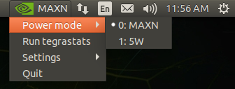
</p>

O mediante el comando ```nvpmodel``` en una terminal. Los siguientes comandos serán utiles en caso de buscar modificar el modo de funcionamiento de la Jetson Nano.

```
# Change mode to MAXN
sudo nvpmodel -m0

#Change mode to 5W
sudo nvpmodel -m1

# Check what mode is on
nvpmodel -q
```

**OPCIONAL:** *Para poder observar todas las posibilidades de este comando, por favor ejecute el siguiente comando.*

```
nvpmodel -h
```

Estos modos de funcionamiento se encuentran definidos en un archivo de texto. Modificar este archivo puede ser una maner útil de añadir nuevos modos de funcionamiento o modificar los ya existentes para usos específicos.

```
cd /etc/nvpmodel
gedit nvpmodel_t210_jetson-nano.conf
```

Adicionalmente, la frecuencia de la Jetson Nano puede ser modificada mediante el uso de comandos de terminal. Para observar la frecuencia actual sobre la que esta trabajando la placa, podemos utilizar el siguiente comando.

```
sudo jetson_clocks --show
```

Si la frecuencia actual de la Jetson Nano se encuentra en los valores mínimos, se puede modificar al máximo mediante el siguiente comando.

```
# This command maximizes clock frequency
sudo jetson_clocks

# Check frequencies again
sudo jetson_clocks --show
```

## Utilidades de la Jetson Nano

Para poder utilizar diferentes utilidades pertenecientes a la Jetson Nano, primero se deben instalar mediante el siguiente comando y reiniciar para aplicar cambios.

```
# Check that Python and pip are correctly installed
sudo apt install python3-dev python3-pip

# Install Jetson Nano utilities
sudo -H pip3 install -U jetson-stats

# Reboot the sistem to apply changes
sudo reboot
```

Una vez reiniciado, podremos hacer uso de los siguientes comandos.

```
# Shows the state of the Jetson Nano
jtop

# Menu to show health state and modify different options
jetson_config
```

Si mantienes pulsado la tecla de Windows (también conocida como Super), te mostrará los atajos de teclado propios de la Jetson Nano.

## Pruebas con redes neuronales en Notebooks en el ordenador adicional

Este apartado trata las diferentes pruebas realizadas con redes neuronales y sus cuantizaciones mediante el uso de Jupyter Notebook.

Para poder hacer uso de estes códigos autocontenidos en Notebooks, es necesario instalar ciertos paquetes que se pueden observar a continuación.

```
# Install Python3 package manager
sudo apt install python3-pip

# Install Jupyter Notebook
pip3 install notebook

# In my case, I needed to add my bin to PATH.
# If the PC doesnt complain to you asking for this, DONT do it
PATH=$PATH:/home/brais.martinez/.local/bin

# Install Pytorch and required dependencies
pip3 install torch torchvision torchaudio --index-url https://download.pytorch.org/whl/cpu

# Install Matplotlib for representation
pip3 install matplotlib

# (Optional) Install Pytorch quantization library from NVIDIA
pip install --no-cache-dir --extra-index-url https://pypi.nvidia.com pytorch-quantization
```

Una vez se terminen de descargar estos paquetes, se podrá comprobar su funcionamiento mediante el siguiente comando:

```
jupyter notebook
```

Este comando es el necesario para abrir la ventana Notebook en el navegador, que nos permitirá acceder y ejecutar los Notebooks autocontenidos sobre redes neuronales.

Para ello, si ha descargado este repositorio de manera directa, diríjase a la carpeta base del repositorio (donde se encuentra este archivo si se ha descargado completo). Una vez en la carpeta base, ejecute el comando anterior. Desde dentro de la interfaz gráfica desplegada, podrá acceder a los Notebooks desarrollados.

#### Instrucciones recomendadas para la primera ejecución de Jupyter Notebook

Si está es su primera ejecución de los archivos de Jupyter Notebook o está teniendo problemas con los datasets y sus carpetas, por favor ejecute las instrucciones aqui mostradas.

El primer paso sería descomprimir los datasets de ImageNet1k y Small-ImageNet1k, que se encuentran en sus respectivas carpetas. Proceda a descomprimir los zips en la misma carpeta en la que se encuentran.

El segundo paso sería generar el resto de carpetas de las que depende la ejecución de los Notebooks. Para ello, abra Jupyter Notebook con el siguiente comando dentro de la carpeta base del repositorio.

```
jupyter notebook
```

Una vez abierto Jupyter Notebook, diríjase al Notebook denominado Setup y ejecutelo. Este Notebook unicamente creará las carpetas necesarias para el correcto funcionamiento del resto de Notebooks en el lugar donde tenga abierto Jupyter Notebook.

Se recomienda ejecutar el Notebook ```Setup.ipynb``` antes de comenzar a trabajar sobre cualquiera de los otros Notebooks, y descomprimir los .zip encontrados en las carpetas ```ImageNet1k``` y ```Small-ImageNet1k``` antes de utilizar el Notebook ```ResNet.ipynb```. Los .zip se descomprimen directamente en la carpeta en la que se encuentran y no requieren de ninguna modificación.

<!-- Songs recomendation: "Maverick" and "Farewell" from Talisk -->

## Conexión de la cámara de Raspberry Pi a la Jetson Nano

Para poder conectar el módulo de cámara de Raspberry a la Jetson Nano, primero es necesario conectar dicha cámara mientras la Jetson Nano está apagada. Para ello, podemos utilizar el siguiente comando dentro de una terminal de la Jetson, que se puede abrir mediante ```Ctrl + Alt + T```:

```
# This commands shuts down the Jetson Nano
poweroff
```

Una vez la Jetson Nano esté apagada, se podrá conectar la cámara a esta. Este proceso se debe realizar mientras se encuentre apagada para que la Jetson reconozca correctamente el periférico. Dicha conexión se debe realizar en el siguiente puerto.

<p align="center" width="100%">
    
</p>

Para abrirlo, pasamos la uña por debajo de la solapa negra y empujamos suavemente. Seguiremos tirando hasta que el elemento del conector con la solapa caiga un poco hacia atrás. El conector posee un enganche en cada uno de los lados, asi que si queda atascada de uno de ellos, ejerza fuerza ligeramente en ese lado para desengancharlo.

Una vez levantada la solapa, conectaremos el cable procedente de la cámara. Este debe conectarse con la marca azul apuntando hacia el exterior de la Jetson Nano, como se puede ver en la siguiente imagen.

<p align="center" width="100%">
    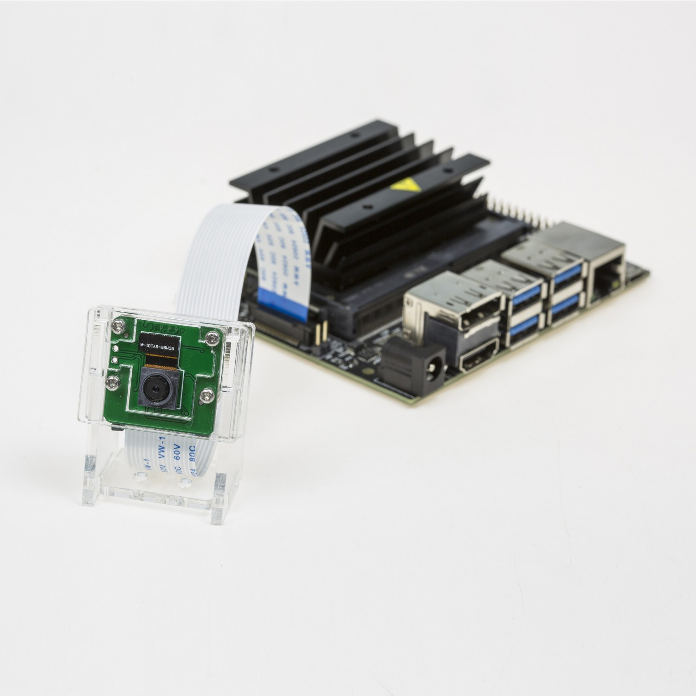
</p>

A continuación, para poder utilizar el módulo de la cámara Raspberry mediante la Jetson Nano, es necesario comprobar que la Jetson Nano se encuentra actualizada. Para ello, utilizaremos el siguiente comando.

```
# This command will update the Jetson Nano OS. (It will take a while)
sudo apt-get update & sudo apt-get upgrade
```

Durante este comando, es posible que salgan ciertos errores sobre documentos de configuración modificados. Introduciremos ```Y``` en todos este casos para aceptar la suplantación de estos archivos.

Adicionalmente, Docker nos preguntará si queremos reiniciar el *daemon* para efectuar los cambios que esta actulización implementa. Es necesario permitir este reinicio.

Finalmente, reiniciaremos la Jetson Nano para aplicar los cambios sobre el sistema operativo. Para ello, podemos usar el comando:

```
reboot
```

Una vez volvamos del reinicio, podemos pasar a comprobar si la camara funciona. Para ello, podemos utilizar el siguiente comando.

```
# Check if theres a video input 
# (if the output is "/dev/video0" in yellow characters, everything is alright)
ls /dev/video0
```

Si este comando nos proporciona de vuelta ```/dev/video0``` en amarillo, el sistema es capaz de encontrar la entrada de video. En caso de problemas, se puede probar con video1 o reiniciando la Jetson Nano.

Finalmente, para extraer video directamente de la cámara, se puede hacer de manera sencilla con el siguiente comando.

```
# Displays output video
nvgstcapture-1.0 --orientation=2
```

Si todo esta correctamente, el comando debería abrir una ventana que mostrará video en tiempo real tomado por la cámara. Para cerrar este video, hagan uso de ```Ctrl + C``` en la terminal donde se ejecuto el comando.

<!-- During the making of this README, I watched Frieren: Beyond Journey's End. Its pretty cool, go watch it -->

## Uso de GStreamer para el control de los parámetros de la cámara

<!-- Wikipedia, my beloved-->
GStreamer es un framework multimedia open-source multiplataforma que permite crear aplicaciones audiovisuales.

Este tiende a ser utilizado junto con la libreria open-source de visión artificial desarrollada por Intel, junto con su implementación también hecha por Intel de ambos elementos, conocida como DLStreamer.

Por el momento, vamos a aprender a utilizar GStreamer. 

GStreamer se basa en el uso de pipelines para la gestión y transformación de video. Se puede plantear la arquitectura de estas pipelines como una tubería, que deben conectar la entrada de video desde la cámara hasta la salida de video por el monitor.

Podemos utilizar ```nvarguscamerasrc```, herramienta de Nvidia para GStreamer, para obtener video mediante pipeline.

```
# Shows exatcly what the camera is seeing
gst-launch-1.0 nvarguscamerasrc ! nvoverlaysink
```

Los dos elementos de una pipeline van unidos por un enlace, representado por ```!```. El primer elemento indica el módulo que GStreamer va utilizar para tomar la imagen, mientras que el segundo se trata de un *sink*, que nos presenta la imagen en la pantalla. En este caso, se trata de **nv**-**overlay**-**sink**. Como su nombre indice, es un sink(salida de video) basada en un overlay(ocupa toda la pantalla).

Como se puede observar, la imagen se encuentra invertida, debido a que esta es la naturaleza de la visión de la camara. Para invertir la imagen, podemos utilizar una pipeline como la siguiente.

```
# Streams flipped video from camera 
gst-launch-1.0 nvarguscamerasrc ! nvvidconv flip-method=2 ! nvegltransform ! nveglglessink -e
```

La instrucción ```nvvidconv``` sirve para realizar transformaciones a la imagen, por lo que mediante la instruccion ```flip-method=2``` podemos rotar la imagen 180 grados.

Debido a que realizamos una transformación, ```nvoverlaysink``` ya no es capaz de aceptar la salida de la pipeline, citando un error de mapeado. Para poder observar el video obtenido, podemos realizar una transformación  mediante ```nvegltransform``` y finalmente, obtener la salida de video mediante ```nveglglessink -e```.

El propósito de uso de GStreamer son sus grandes capacidades para efectuar control sobre diversos parámetros de la cámara. Para ello, es necesario introducir múltiples opciones que permitan controlar estos parámetros sin perder información.

```
# Modifies video parameters on a flipped video
gst-launch-1.0 nvarguscamerasrc saturation=1 ! nvvidconv ! videobalance contrast=1.5 brightness=-0.3 ! nvvidconv flip-method=2 ! nvegltransform ! nveglglessink -e
```

Para ello, es necesario realizar una ```nvvidconv``` antes y despues de la modificación de los parámetros de video mediante ```videobalance```. La segunda ```nvvidconv``` contiene el método de flip, mientras que la primera unicamente sirve para transformar la imagen en un formato que ```videobalance``` pueda entender. Finalmente, extraemos el video modificado por pantalla.

Si eliminamos el segundo ```nvvidconv``` y modificamos el *sink* para que acepte la salida de ```videobalance```, obtendremos el video en blanco y negro. Es debido a esto que se necesita el segundo ```nvvidconv```, para hacer la transformación de vuelta. El flip-method podria ir en cualquiera de los dos ```nvvidconv```.

---

*PSSSSSSSSS! Si teneis curiosidad sobre el error, podeis hacer esto :D*

```
# Outputs modified flipped video in black and white
gst-launch-1.0 nvarguscamerasrc saturation=1 ! nvvidconv flip-method=2 ! videobalance contrast=1.5 brightness=-0.3 ! nvoverlaysink
```

*Luego podeis cambiar el ```nvoverlaysink``` por ```nvvidconv ! nvegltransform ! nveglglessink -e``` y ver como se arregla.*

---

Finalmente, podemos modificar parámetros mas complejos de la cámara, como puede ser la ganancia o el tiempo de exposición. Ya que las bases de GStreamer ya esta planteadas, planteo directamente el siguiente comando.

```
# Video modification of exposure and gain
gst-launch-1.0 nvarguscamerasrc saturation=1 wbmode=0 awblock=true gainrange='8 8' ispdigitalgainrange='4 4' exposuretimerange='5000000 5000000' aelock=true ! nvvidconv ! videobalance contrast=1 brightness=0 ! nvvidconv flip-method=2 ! nvegltransform ! nveglglessink -e
```

Estos valores se pueden modificar para obtener diferentes salidas. Para poder obtener todas las posibilidades de ```nvarguscamerasrc``` y poder comprobar que parámetros se pueden modificar, empleen el siguiente comando.

```
# Inspect all options from nvarguscamerasrc
gst-inspect-1.0 nvarguscamerasrc
```

## **OPCIONAL:** Tutorial y trucos de git

*Este apartado servirá como inicialización a Git para aquellas personas que no lo conozcan, no lo usen habitualmente o quieran dar un repaso. Si ya está acostumbrado a Git, puede saltarse este apartado sin problema.*

Git es un software de control de versiones ampliamente utilizado en la industria software debido a su facilidad de uso y su utilidad para guardar versiones de código o distintos elementos. Git es la base de distintas aplicaciones web, como pueden ser <a href="https://github.com/" target="_blank" rel="noreferrer">Github</a> o <a href="https://about.gitlab.com/" target="_blank" rel="noreferrer">Gitlab</a>.

Este apartado busca explicar los conceptos básicos de Git para su uso en posteriores apartados. Para ello, podemos crear una carpeta donde trabajar.

```
# Use command on new terminal to create new folder
mkdir repo

# Go to new folder called 'repo'
cd ~/repo
```

<!-- Fight for SuperEarth! Join the Helldivers! -->

Git funciona mediante repositorios. Estos repositorios son almacenes de datos sobre el proyecto en el que se está trabajando. Un repositorio se divide en distintas ramas, que son diferentes flujos de trabajos independientes entre ellos, donde se pueden realizar modificaciones sin afectar a otras ramas. Las ramas son útiles para generar distintas versiones, ya sea para hacer pruebas o crear distintas distribuciones de un mismo código. Para crear nuestro primer repositorio, utilizaremos el siguiente comando dentro de la carpeta base del proyecto que queramos guardar (**por favor**, no lo hagais en la raiz del sistema).

```
# Initialize a local repository
git init
```

De esta manera, hemos creado un repositorio local. Este consiste de una carpeta oculta denominada ```.git``` que contendrá todas las acciones realizadas mediante Git. Pueden observar su existencia mediante el comando ```ls -a```. Este repositorio solo existe dentro de nuestro ordenador y no puede ser accedido desde el exterior. Paginas como <a href="https://github.com/" target="_blank" rel="noreferrer">Github</a>, <a href="https://about.gitlab.com/" target="_blank" rel="noreferrer">Gitlab</a> o <a href="https://bitbucket.org/product/" target="_blank" rel="noreferrer">BitBucket</a> ofrecen un lugar donde almacenar repositorios remotos, es decir, estos mismos repositorios de manera que puedan ser accedidos por otras personas o por nosotros mismos en caso de que cambiemos de ordenador o perdamos los datos. El de uso mas común para uso personal es <a href="https://github.com/" target="_blank" rel="noreferrer">Github</a>, por lo que recomiendo hacerse una cuenta (aunque no es obligatorio para seguir los pasos).

Si creamos un repositorio remoto en alguna de estas páginas seleccionadas, podemos linkearlos con el repositorio local. No es obligatorio, pero si recomendable.

```
# Add remote repo as origin
git remote add origin <URL of the remote repo>
```

Una vez tenemos el repositorio local creado (y linkeado a uno remoto, si lo hicisteis), podemos proceder a escribir código o añadir archivos. Para hacer una prueba rapida, podemos crear un archivo rapido de texto y guardarlo como cambio. Por favor, creadlo dentro de la carpeta que useis como repositorio local.

<!-- Don't steal my identity -->
``` 
# Create a txt with your name inside (please use your name and not mine)
echo "Brais M. Adrover" >> tmp.txt

# Now you can check the contents of the txt
more tmp.txt
```

Una vez tenemos un archivo nuevo en nuestro repositorio, podemos añadirlo a los cambios que queremos guardar mediante el comando ```git add```. La forma de usar dicho comando se muestran a continuación.

```
# Adds everything in the workspace
git add .

# Adds a file
git add tmp.txt

# You can use the second method to add single files or even entire folders
```

Una vez los elementos estén añadidos, tenemos que confirmarlos. Estos elementos no están todavia guardados, sino que se encuentran en el cache. Se pueden observar los elementos modificados que se encuentran en cache mediante el comando ```git status```. Adicionalmente, se pueden observar las modificaciones realizadas sobre estos archivos mediante el comando ```git diff```, que puede proporcionar mas información sobre estos cambios mediante la flag ```--staged```.

Para guardar de manera definitiva, es necesario formalizar los cambios realizados a una versión mediante el comando ```git commit```. Este comando establece todos los cambios realizados como parte de una versión, que puede recibir una descripción. El siguiente cuadro de texto explicará como utilizar ```git commit```.

```
# Standard use of commit
git commit -m "Small identifier of changes"

# Expanded use of commit (read it, dont copy)
git commit -m "If you dont close with another quotation mark and press enter,
> you can write on different lines
> without repercussion.
> Use it with caution
> Close again with
> "
```

Vamos a guardar el nuevo archivo creado, con el comando anterior.

```
# Commit the changes made
git commit -m "Added file with name"
```

Este archivo ahora se encuentra guardado dentro del repositorio. Si realizan modificaciones sobre este archivo y buscan guardarlas, deberían volver a empezar desde ```git add```.

```
# Modify the txt
echo "Brais Martinez A." >> tmp.txt

# Add the changes
git add .

# Commit the changes
git commit -m "Modified tmp"
```

Si contamos con un repositorio remoto, podemos sincronizar el repositorio remoto con el repositorio local. Para ello, será necesario usar el siguiente comando.

```
# Push changes from local repo to remote repo
git push -u origin main 

# or (if it fails)

git push -u origin master
```

El comando de arriba depende de la aplicacion web que utiliceis. Mientras que algunas llaman a su rama principal ```main```, otras la llaman ```master```. origin está definido de antes mediante el comando ```git remote add origin <URL of the remote repo>```. 

Las ramas son versiones del respositorio que pueden ser guardadas independientemente entre ellas. Todo repositorio cuenta con al menos una rama, denominada ```main``` o ```master```. Se pueden crear ramas adicionales mediante el siguiente comando.

```
# Create new branch called 'pruebas'
git branch pruebas
```

Para visualizar las ramas, podemos volver a usar el mismo comando.

```
# Visualize branches
git branch
```

Una de estas ramas se encontrará marcada por un asterisco (*) y con su nombre en verde. Esta rama marcada es la rama en la que nos encontramos. Para cambiar la rama sobre la que trabajamos, podemos utilizar el siguiente comando.

```
# Change active branch (change 'pruebas' if you used another name)
git checkout pruebas

# Check the active branch is changed
git branch
```

Ahora que la rama activa ya no es la principal, podemos proceder a realizar todas las modificacines necesarias sin miedo a modificar otras ramas. Para poner un ejemplo, podemos añadir una nueva linea al documento anterior.

```
# Add new line to tmp.txt
echo "CITIUS 2024" >> tmp.txt

# Use more to check the file
more tmp.txt
```

Ahora que se han realizado modificaciones en la rama pruebas, ambas ramas cuentan con archivos diferentes. Si bien podriamos hacer ```git checkout master``` para volver a la rama principal, los cambios en esta rama no estan commiteados. Si intentamos cambiar ahora, Git tratará de asemejar las ramas lo maximo posible, pasando los cambios realizados en una a la otra. Si no es capaz de hacer este paso, no nos dejará cambiar. Para solucionar este problema y no mezclar las modificaciones de dos ramas distintas, solo tenemos que volver a comitear los cambios.

```
# Save changes to belong to pruebas branch
git add .
git commit -m "Changes to pruebas branch"

# Check changes to tmp in pruebas
more tmp.txt

# Change branches
git checkout master

# Check unchanged file in master branch
more tmp.txt
```

Como habras podido observar, el archivo de la rama pruebas ha mantenido su modificación mientras que el de la rama master no. Imaginemos ahora que nos gustan los cambios realizados sobre la rama prueba y queremos mezclar ambas ramas, es decir, juntar los contenidos de ambas ramas y hacer una sola. Para ello, deberemos hacer uso del siguiente comando.

```
# Fuses another specified branch to your active branch
git merge pruebas (if we are on master)
git merge master (if we are on pruebas)

# Use the following command to check
git branch

# After merging, use more to check the txt file
more tmp.txt
```

Una vez los cambios estan en la rama principal, podemos proceder a borrar la rama de pruebas. Para ello, podemos usar el siguiente comando.

```
# Delete branch
git branch -d pruebas

# Check that it was deleted
git branch
```

Finalmente, vamos a eliminar el archivo de texto. Eliminar algo es una modificación, y Git es capaz de reconocerla. De esta manera, si subimos algo a un repositorio remoto y queremos borrarlo, podemos borrarlo en local y pushear los cambios al remoto, que provocará que se cambien.

```
# Delete the txt
rm tmp.txt

# Now check the status
git status

# If the file is marked as deleted, you can add and commit the changes
git add .
git commit -m "txt deleted"
```

Finalmente, Git también es de gran utilidad para la distribución de código. Para ello, se utiliza el comando ```clone```, que ya se utilizará mas adelante para descargar los repositorios necesarios.

```
# Download a copy of someones repo
git clone <URL URL of the remote repo>
```

---

#### Detalles adicionales

Si el repositorio remoto es diferente al local, ya sea porque modificamos directamente el remoto o porque subimos cambios desde otro local distinto, podemos aplicar estos cambios sobre el local que usemos mediante el siguiente comando.

```
# Updates local repo to newest commit
git pull
```

Visual Studio Code cuenta con una extensión para el uso de Git, denominada Gitlens. Se puede encontrar en la pestaña **Extensiones** de Visual Studio, o en su página: <a href="https://www.gitkraken.com/gitlens" target="_blank" rel="noreferrer">Gitlens, by GitKraken</a>

Se puede crear un archivo ```.gitignore``` mediante el comando ```touch .gitignore```. Todos los PATHs a ficheros y/o carpetas que se coloquen dentro de este archivo no se guardarán mediante los comandos ```git add``` o ```git commit```.

---

#### Enlaces

Si quereis otro tutorial sencillito (y mas completo), podeis dirigiros a este: <a href="http://rogerdudler.github.io/git-guide/index.es.html" target="_blank" rel="noreferrer">Git - The simple guide</a>

Si quereis profundizar en Git, podeis empezar por aqui: <a href="https://github.com/progit/progit2-es" target="_blank" rel="noreferrer">ProGit 2º Edition ~ Spanish Version</a>

---

#### Consejo a futuro 

Si alguna vez teneis un problema de que la liasteis con Git y no sabeis como resolverlo, podeis acudir a la página <a href="https://ohshitgit.com/" target="_blank" rel="noreferrer">Oh Shit, Git!?!</a>

## Setup del repositorio Jetson-Inference y JetPack

Para poder trabajar con los siguientes repositorios, es necesario primero comprobar la versión del software instalado en la Jetson Nano (pese a que os lo podría decir yo). Para obtener información sobre estas versiones, podemos usar otro repositorio que nos proporciona un script para solucionar este problema.

```
# Go to home directory
cd

# Needed repo for version checking
git clone https://github.com/jetsonhacks/jetsonUtilities.git
```

Para usar el script, entraremos en la carpeta y ejecutaremos el programa python encontrado dentro.

```
# Enter the newly downloaded repo
cd jetsonUtilities

# Run the python script
python3 jetsonInfo.py
```

Este script dará una salida de texto similar a la siguiente.

<p align="center" width="100%">
    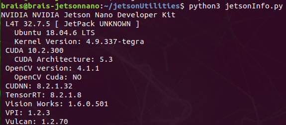
</p>

De esta salida, podemos obtener bastante información sobre el estado del software de nuestra Jetson Nano. Actualmente, el dato que nos importa es la versión de L4T (Jetson Linux Driver Package). Como se puede ver, la versión es 32.7.5. Esto nos servirá para determinar los pasos a seguir en función de nuestras versiones del software instalado, que se pueden ver en la salida de la terminal.

Previo al clonado del repositorio, procederemos a preparar el entorno.

```
# Update and upgrade the OS
sudo apt-get update && sudo apt-get upgrade

# Check if everything is installed
sudo apt-get install git cmake
```

Una vez tenemos el entorno preparado, podemos proceder a utilizar Jetson Inference. Para descargar el repositorio, podemos utilizar el siguiente comando.

```
# Clone the Jetson Inference repo
cd && git clone https://github.com/dusty-nv/jetson-inference.git

# Get inside the repo and switch to branch for Jetson Nano
cd jetson-inference && git checkout L4T-R32.7.1

# Install submodules and dependencies
git submodule update --init
```

Ahora, vamos a comprobar que las dependencias necesarias de Python están instaladas.

```
sudo apt-get install libpython3-dev python3-numpy
```

Vamos a preparar el repositorio para su compilación.

```
# Omit if you are already here
cd ~/jetson-inference

# Create compilation folder
mkdir build

# Configure the cmake
cd build
cmake ../
```

El repositorio cuenta con varios scripts de instalacion predifinidos, pero en este caso, nos interesan especialmente dos.

El primero de ellos es la herramienta de descarga de modelos, que se ejecutará durante la configuración. En esta pestaña, podemos seleccionar los modelos que queremos descargar e importar. En mi caso, yo deje los modelos que vienen por defecto seleccionados.

<p align="center" width="100%">
    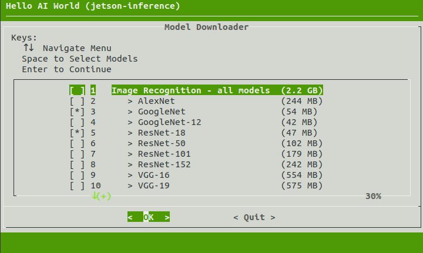
</p>

Si necesita volver a esta ventana para seleccionar nuevas opciones, puede utilizar los siguientes comandos.

```
cd jetson-inference/tools
./download-models.sh
```

El segundo script trata la instalación de Pytorch. Sobre esta ventana, seleccionamos la versión de Pytorch para Python3 (la única que me sale a mi).

<p align="center" width="100%">
    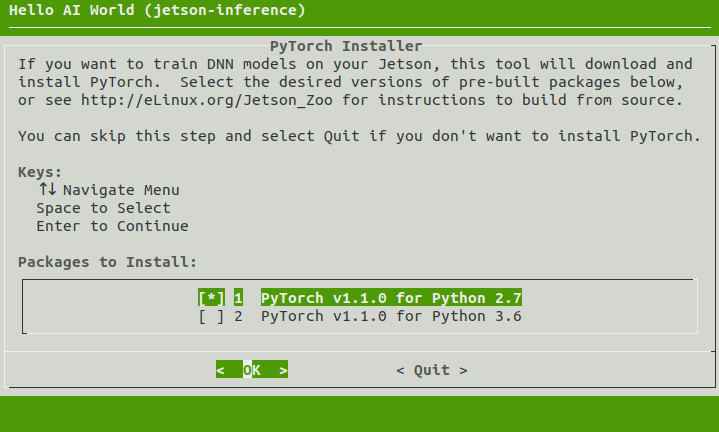
</p>

De nuevo, si se necesitará volver a esta ventana para seleccionar una nueva opción, utilice el siguiente comando.

```
cd jetson-inference/build
./install-pytorch.sh
```

Cuando el repositorio termine de configurar la carpeta ```build```, podemos pasar a compilarlo para su posterior uso. Los comandos de compilación se encuentran a continuación.

```
# Omit if you are already there
cd jetson-inference/build

# Compile the repo
make
sudo make install
sudo ldconfig
```

**ATENCIÓN:** Esto tomará un tiempo. Podeis ir a por un cafe :)

Finalmente, todo el repositorio quedará buildeado dentro de la carpeta ```build```, con una arquitectura de carpetas similar a lo siguiente.

```
build
  \aarch64
    \bin         ->  Where the sample binaries are built
      \networks  ->  Where the network models are stored
      \images    ->  Where images and test images are stored
    \include     ->  Where the headers reside
    \lib         ->  Where the libraries are built
```

Los ejecutables se encuentran en el PATH ```jetson-inference/build/aarch64/bin```, pero también se instalan a nivel local en ```/usr/local/``` durante la compilación gracias al comando ```sudo make install```.
These also get installed under /usr/local/ during the sudo make install step.

```
The Python bindings for the jetson.inference and jetson.utils modules also get installed during the sudo make install step under /usr/lib/python*/dist-packages/. If you update the code, remember to run it again.
```

Este aviso no es mio, pero se encuentra en los documentos del repositorio, asi que voy a añadirlo para su uso futuro.

## Uso del repositorio Jetson-Inference

### Uso de los ejecutables presentes en el repositorio

---

#### Clasificación

---

Una forma de hacer uso del repositorio es utilizando los ejecutables ya implementados para diversas aplicaciones. Estos ejecutables proporcionan diversos ejemplos de uso para diversas aplicaciones, como clasificación, detección y/o segmentación. Todo el código correspondiente a estos ejecutables se encuentra en los apartados de ejemplos del repositorio, tanto para C++ como para Python. Para acceder a los ejecutables ya presentes dentro del repositorio, debemos acceder al directorio ```jetson-inference/build/aarch64/bin```. 

Como primer contacto con la clasificación de imágenes, se puede realizar inferencia sobre una imagen tomada directamente del repositorio. El comando es el siguiente. Si es la primera vez que se ejecuta, tarda un poco.

```
# Do inference over an image (use any image you like)
./imagenet images/orange_0.jpg

# Store the image if you feel like it disappeared too fast
./imagenet images/orange_0.jpg images/test/output_0.jpg
```

Este comando usa la versión de C++ de este programa. Para usar la versión de Python, reemplazar ```./imagenet``` por ```./imagenet.py```. Este caso se repite para cualquier ejecutable que se muestre en este apartado.

La red utilizada para la inferencia sobre estas imagenes se puede modificar mediante el uso de *flag*. La lista de los modelos disponibles para clasificación es la siguiente. GoogleNet es la red de clasificación por defecto.

<p align="center" width="100%">
    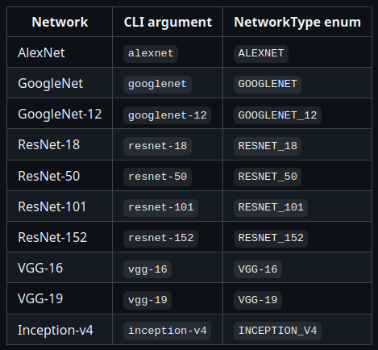
</p>

Para modificar el modelo utilizado, podemos añadir la *flag* ```--network``` a los comandos anteriores. Cada vez que se usa un modelo nuevo, el sistema tiene que descargarlo y ajustarlo, por lo que tarda un poco la primera vez.

```
# Use another model to check the same image
./imagenet --network=alexnet images/orange_0.jpg

# You may need to download the additional models. That can be done with the previously shown command.
cd jetson-inference/tools
./download-models.sh
```

Una vez volvemos al directorio de ejecutables (y suponiendo que tenemos la camara conectada. Si no la teneis, apagad la Jetson Nano y conectadla), deberiamos determinar el tipo de cámara que poseemos para poder hacer inferencia sobre los datos aportados por la misma, pero para este caso, ya os indico yo que la cámara es una MIPI CSI de Raspberry Pi.

Con esto en mente, podemos utilizar el siguiente comando para ejecutar un programa que aplicará una red entrenada (que en este caso es GoogleNet) sobre ImageNet a la salida de la cámara.

```
# Run the ImageNet program with the output from camera CSI 0
./imagenet.py csi://0

# Change the network if you like with '--network=<network-identifier>'
./imagenet.py csi://0 --network=resnet-50
```

---

#### Detección

---

Volvemos al directorio donde se encuentran los ejecutables en ```jetson-inference/build/aarch64/bin```. El uso de eset ejecutable es muy similar a la casuística anterior, por lo que los comandos a continuación serviran como un ajusta de ese conocimiento a este segmento.

```
# Apply detection to an image
./detectnet images/peds_0.jpg

# Change model on the same image
./detectnet --network=pednet images/peds_0.jpg

# Apply detection to camera output
./detectnet csi://0

# Apply different model to camera detection
./detectnet csi://0 --network=ssd-mobilenet-v2
```

La lista de modelos para detección es la siguiente. SSD-MobileNet-V2 es la red por defecto para detección de objetos.

<p align="center" width="100%">
    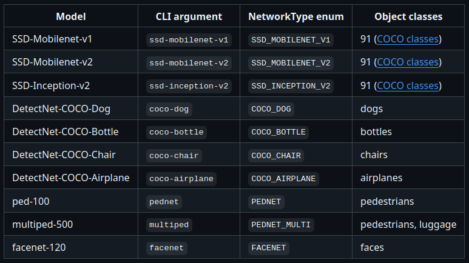
</p>

Adicionalmente, ```./detectnet``` cuenta con un mayor número de *flags* que ```./imagenet```.

* ```--overlay``` puede ser una combinación (separada por comas) de los argumentos: ```box```, ```lines```, ```labels```, ```conf``` y ```none```. Por defecto, el sistema trabaja con los argumentos ```box```, ```labels``` y ```conf``` (**conf**idence values).

* ```--alpha``` modifica el valor 'alpha' utilizado durante el *blending* de la *flag* ```--overlay```. Su valor por defecto es 120.
  
* ```--threshold``` establece el valor mínimo de confianza para el sesgado de la detección. Por defecto, el valor es 0.5.

Mediante el siguiente comando, se puede ordenar al ejecutable a realizar la inferencia sobre un directorio de images de manera directa. Durante esta inferencia, el sistema mostrará las imagenes resultantes de manera muy rápida, por lo que se adjunta un segundo comando para guardar dichas imagenes y permitir así la comprobación de los resultados.

```
# Do inference on several images
./detectnet "images/peds_*.jpg"

# Save those results to check later
./detectnet "images/peds_*.jpg" images/test/peds_output_%i.jpg
```

```./detectnet``` permite la inferencia sobre video pregrabado, como se muestra mediante el siguiente comando. Este video también puede ser guardado con los resultados de la inferencia.

```
# Do inference on the video
./detectnet /usr/share/visionworks/sources/data/pedestrians.mp4

# Save the video for further analysis
./detectnet /usr/share/visionworks/sources/data/pedestrians.mp4 images/test/pedestrians_ssd.mp4
```

---

#### Segmentación

---

Debido a las caracteristicas de los modelos de segmentación, este ejecutable no cuenta con un modelo de red ejecutado por defecto, por lo que es necesario elegir un modelo a ejecutar dependiendo de la resolución a la que trabaja y los FPS que alcanza en la Jetson Nano.

<p align="center" width="100%">
    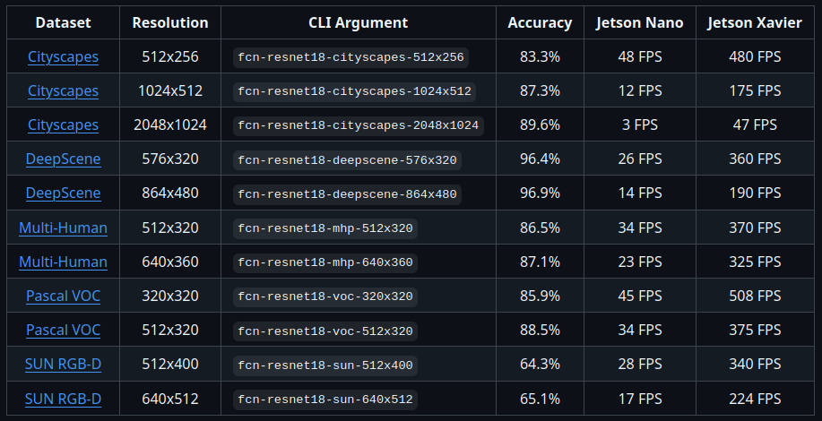
</p>

Si el comando no contiene la resolución de la red deseada, se utilizará la red de más baja resolución, priorizando la velocidad.

Estos modelos está entrenados sobre diferentes tipos de *datasets*, lo que provoca que tengan diferentes utilidades y objetos reconocidos dependiendo del enfoque de su entrenamiento. A continuación, se explicará el contexto de cada uno de estos *datasets*.

* Los modelos entrenados sobre el *dataset* ```Cityscapes``` proveen de una segmentación centrada en elementos de un entorno urbano.

```
./segnet --network=fcn-resnet18-cityscapes images/city_0.jpg
```

* Los modelos entrenados sobre el *dataset* ```DeepScene``` se centran en caminos exteriores y la vegetación, principalmente debido a su enfoque en la navegación de robots en entornos exteriores.

```
./segnet --network=fcn-resnet18-deepscene images/trail_0.jpg
```

* El *dataset* ```MHP (Multi-Human Parsing)``` se centra en la descripción y etiquetado de múltiples partes del cuerpo, así como distintos elementos de ropa.

```
./segnet --network=fcn-resnet18-mhp images/humans_0.jpg
```

* ```Pascal VOC``` es uno de los datasets originales de segmentación semántica, de manera que contiene una variedad de personas, objetos, vehículos y animales.

```
./segnet --network=fcn-resnet18-voc images/object_0.jpg
```

* El *dataset* ```SUN RGB-D```  proporciona segmentación para escenas interiores, como espacios de oficiona o habitaciones de un hogar.

```
./segnet --network=fcn-resnet18-voc images/object_0.jpg
```

Como *flags* adicionales, ```./segnet``` provee de algunas opciones para modificar la salida esperada. Estas opciones son las siguientes.

* ```--visualize``` afecta al modo de visualización de los resultados de la inferencia. Acepta los modos ```mask``` y/o ```overlay``` (por defecto).
  
* ```--alpha```  flag sets the alpha blending value for overlay (default is 120)

* ```--filter-mode``` acepta las opciones ```point``` y ```linear``` para el muestreo. La opción por defecto es ```linear```.

Finalmente, ```./segnet``` cuenta con utilidades previamente vistas en apartados anteriores, como inferencia sobre un directorio o sobre la entrada de una camara.

```
# Inference on an entire directory
./segnet --network=fcn-resnet18-sun "images/room_*.jpg" images/test/room_output_%i.jpg

# Inference on camera output 
./segnet --network=fcn-resnet18-mhp csi://0
```

---

#### Estimación de pose

---

La penúltima utilidad implementada en el respositorio es la estimación de las poses. Los comandos para esta estimación son muy similares a los planteados anteriormente, por lo que no se considerará necesario explicar las bases de su funcionamiento. El ejecutable implementado solo cuenta con 3 modelos entre los que escoger, que son los siguientes.

<p align="center" width="100%">
    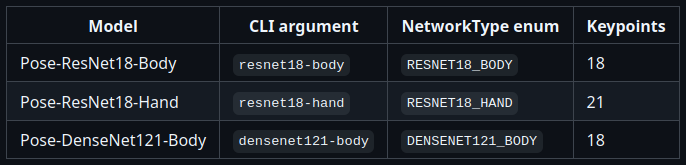
</p>

Las *flags* adicionales implementadas en el ejecutable de estimación de pose son las siguientes:

* ```--network``` para modificar el modelo. El modelo por defecto es ```resnet18-body```.

* ```--overlay``` que puede componerse de una combinación (separadas por comas) de los siguientes argumentos: ```box```, ```links```, ```keypoints``` y ```none```. El estado por defecto es ```links``` y ```keypoints```, de manera que se muestren los puntos por encima de las lineas conectoras.

* ```--keypoint-scale``` controla el radio de los puntos creados mediante el argumento ```keypoints``` de la *flag* ```overlay```. El valor por defecto es 0.0052.

* ```--link-scale``` regula el ancho de las lineas creadas mediante el argumento ```links``` de la *flag* ```overlay```. El valor por defecto es 0.0013.
  
* ```--threshold``` regula el valor mínimo de confianza para establecer una detección. El valor pr defecto es 0.15.

Como ejemplos de los posibles comandos a utilizar para hacer uso de este ejecutable, se pueden encontrar los siguientes:

```
# Inference (body) on the dataset
./posenet "images/humans_*.jpg" images/test/pose_humans_%i.jpg

# Inference on the body by camera
./posenet csi://0
```

---

#### Estimación de profundidad monocular

---

El último ejecutable implementado en el repositorio trata la estimación de profundidad mediante el uso de una cámara monocular. Al igual que se menciona en el apartado anterior, los comandos mostrados serán muy similares a aquellos ya explicados en apartados anteriores.

En este caso, unicamente se cuenta con un único modelo para realizar la estimación de profundidad. Debido a esto, pese a que el ejecutable cuenta con una *flag* ```--network```, este solo cuenta con una opción, ```fcn-mobilenet```.

El resto de *flags* opcionales son las siguientes:

* ```--visualize``` cuenta con dos argumentos: ```ìnput``` y ```depth```. El valor por defecto contiene ambos argumentos, lo que mostrará ambas imagenes una al lado de la otra. Para ocultar cualquiera de ellas, eliminela de los argumentos.
  
* ```--depth-size``` regula la escala del tamaño del mapa de profundidad relativo al input. El valor por defecto es 1.0.

* ```--filter-mode``` permite seleccionar el filtro del muestreo mediante los argumentos: ```point``` y ```linear```. El valor por defecto es ```linear```.

* ```--colormap``` regula el mapeado del color utilizado durante la visualización. El valor por defecto es ```viridis_inverted```.

Algunos ejemplos de los posibles comandos a utilizar para hacer uso de este ejecutable podrían ser los siguientes:

```
# Inference on the dataset
./depthnet "images/room_*.jpg" images/test/depth_room_%i.jpg

# Inference on the camera input
./depthnet /dev/video0     # csi://0
```

---

### Inferencia sobre parámetros de cámara modificados

---

Para poder unificar ambas secciones, el control de los parámetros de cámara y la inferencia, se han creado una serie de programas auxiliares para ayudar a utilizar los sistemas planteados. Estos programas se tratan de 3 scripts de Python encargados de modificar los parámetros de la cámara y la inferencia, y compilarlos para su uso posterior.

Estos scripts se pueden ejecutar por separado en el siguiente orden, con diferentes utilidades: ```camera-config.py``` para modificar los parámetros de la cámara, ```camera-build.py``` para construir y compilar los archivos del repositorio y ```camera-inference.py``` para ejecutar una red sobre la salida de la cámara. Cada uno de estos ejecutables cuenta con su serie de flags, que se muestran a continuación.

#### Work pipeline: Camera-Config.py --> Camera-Build.py --> Camera-Inference.py

El primero de estos scripts, ```camera-config.py```, se puede ejecutar de manera independiente para modificar los parámetros guardados de la cámara. Estos parámetros se guardan en un archivo de configuración de las utilidades de Nvidia, por lo que no se modifican a menos que se vuelva a ejecutar el script. La ejecución de este script se puede realizar mediante el siguiente comando: ```python3 camera-config.py``` seguido de las *flags* que considere oportunas, que se muestran a continuación. Todas estas *flags* poseen un valor predeterminado que se puede modificar mediante el uso de la *flag* (acortada/extendida) que corresponda y el argumento en el formato dado. 

En caso de querer hacer una prueba simple del funcionamiento, ```python3 camera-config.py``` funciona como comando directo independiente sin necesidad de *flags*.

### - *Camera-Config flags:*

```-c|--contrast argument```. Default argument value = 1.

```-b|--brightness argument``` . Default argument value = 0.

```-s|--saturation argument``` . Default argument value = 1.

```-wb|--wbmode argument```. Default argument value = 1.

```-et|--exposuretimerange "argument argument"```. Default argument value = "null".

```-gr|--gainrange "argument argument"```. Default argument value = "null".

```-igr|--ispdigitalgainrange "argument argument"```. Default argument value = "null".

```-ec|--exposurecompensation argument```. Default argument value = 0.

```--aelock```. Default argument value = false.

```--awblock```. Default argument value = false.

```--width argument```. Default argument value = 1296.

```--height argument```. Default argument value = 730.

```--framerate argument```. Default argument value = 30.

```--RESET```. This flag resets the camera to original output through a stored savefile. No argument needed.

Para más información sobre los límites de algunas de estas *flags*, leer el archivo *nvarguscamerasrc.txt* encontrado en esta carpeta.

El segundo de estos scripts, ```camera-build.py```, es un script sencillo sin *flags* que se encarga de compilar y (re)buildear los archivos de configuración de Nvidia. Su ejecución es necesaria para guardar cambios realizados sobre los parámetros de la cámara y permitir así la ejecución. Su ejecución se puede realizar de manera directa mediante el comando ```python3 camera-build.py```.

El tercero y último de estos scripts, ```camera-inference.py```, trata la inferencia sobre el resultado de la cámara previamente configurada. Este script mantiene una ejecución similar a las presentadas previamente, con un pequeño añadido. Debido a que este script está planteado para su uso para distintos tipos de inferencias, es necesario especificar la inferencia que queremos en ese momento. Para ello, en el comando de ejecución, ```python3 camera-inference.py job```, es necesario reemplazar el argumento ```job```, con una de las opciones disponibles: ```classification```, ```detection``` o ```segmentation```. Este argumento es obligatorio para el funcionamiento. Como *flags* adicionales, se plantean las presentes en las pruebas previamente realizadas sobre estos modos de inferencia. No todas las *flags* tienen efecto sobre todos los modos de inferencia, ya que esto dependerá de las *flags* que dicha inferencia requiera. Todas las *flags* disponibles se muestran a continuación.

### - *Camera-Inference flags:*

```-m|--model argument```. Default argument value = None.

```--overlay argument```. Default argument value = "'box,labels,conf'".

```--alpha argument```. Default argument value = 120.

```--threshold argument```. Default argument value = 0.5.

```--visualize argument```. Default argument value = 'overlay'.

```--filter-mode argument```. Default argument value = 'linear'.

Mas información sobre cada *flag* se puede encontrar en el apartado dedicado a cada modo de inferencia.

Como opción para facilitar el uso de estos 3 scripts de Python, se ha creado un cuarto ejecutable *bash* mediante el cúal se pueden ejecutar los otros 3, unificando sus ejecuciones. Para utilizarlo, solo es necesario el comando ```./run.sh job```, reemplazando el argumento ```job``` con el modo de inferencia deseado y las *flags* necesarias tanto de configuración de parámetros de cámara como de inferencia sobre la misma.

<!-- It's hard to believe that it's over, isn't it? Funny, how we get attached to the struggle. -->

#### Ejemplos básicos:

```
python3 camera-config.py -c 0.5 -et "'50000 50000'" --awblock
```

```
python3 camera-build.py
```

```
python3 camera-inference.py detection --threshold 0.3 --alpha 100
```

```
./run.sh detection -c 0.5 -et "'50000 50000'" --awblock --threshold 0.3 --alpha 100
```

<!-- ---

### ONNX

---

ONNX (Open Neural Network Exchange) es un formato open-source para tratar ecosistemas del ámbito de la inteligencia artificial. Este formato nos permite iterar sobre redes neuronales de diferente procedencia mediante un sistema estandarizado. 

Para poder utilizar este formato, primero es necesario instalar las librerias y dependencias necesarias para ello. Debido al estado del sistema operativo, este software no puede ser instalado mediante paquetes preconstruidos, por lo que será necesario construir la libreria a partir del *source*.

Para ello, primero instalaremos unas dependencias faltantes del proceso de compilación e instalación. Los comandos a instalar son los siguientes:

```
# Install protobuf (Protocol Buffers) for efficient data serialization
pip3 install protobuf==3.19.6

# Install protobuf required tools
sudo apt-get install libprotobuf-dev protobuf-compiler

# Install setuptools to manage Python packages
pip3 install setuptools
```

Una vez instalados los prerequisitos, se puede pasar a instalar el software desde el *source*. Para ello, descargaremos el repositorio en una versión específica que funciona e instalaremos desde ahi.

```
# Clone the specific version/branch from ONNX main repo
git clone -b rel-1.8.0 --single-branch https://github.com/onnx/onnx.git

# Download/update the submodules
cd onnx
git submodule update --init --recursive

# Install the main package
sudo python3 setup.py install
```

Para probar si el paquete se encuentra correctamente, necesitaremos abrir otra terminal con ```Ctrl + Alt + T``` y escribir ```python3```. Esto nos abrirá una terminal interactiva de Python, donde podemos escribir ```import onnx```. Si al introducir este comando, no recibimos ninguna salida, todo se encuentra correctamente. 

Si la salida es un error similar al siguiente: ```cannot import name 'ONNX_ML'```, prueba a ejecutar los comandos de comprobación fuera de las carpetas del repositorio y en una terminal nueva.

Si el error obtenido es similar a ```Illegal instruction (core dumped)```, ejecute los siguientes comandos y pruebelo de nuevo.

```
# Upgrade pip version
pip3 install --upgrade pip

# Uninstall any numpy version you have installed thats not 1.13.3
pip3 uninstall numpy

# Install new numpy version that doesnt break
pip3 install numpy==1.19.4
```

Una vez ONNX se encuentra correctamente instalado y funcional, podemos pasar a otros elementos interesantes para el uso del formato ONNX. La librería ONNX-Runtime permite la aceleración multi-plataforma de modelos de Machine Learning integrando librerias específicas de hardware. El comando de instalación es el siguiente:

```
# Upgrade pip version
pip3 install --upgrade pip

# Install ONNX-Runtime version that will work with ONNX and numpy versions
pip3 install onnxruntime==1.8.0
```

Se puede comprobar de la misma manera que se comprobo ONNX, mediante el comando ```python3``` e importandolo mediante ```import onnxruntime```. Si da el error mencionado previamente ```Illegal instruction (core dumped)```, vuelva a borrar las versiones de numpy que no sean 1.13.3 e instale la versión 1.19.4.

La última libreria de utilidad para ONNX es ONNX-TensorRT, el cual es un backend de ONNX para TensorRT. Este repositorio también tiene que ser instalado mediante *source*, para lo que necesitaremos actualizar algunas herramientas presentes en la Jetson Nano. La primera de estas herramientas es ```cmake```, herramienta de compilación que se debe encontrar en la versión 1.13 o superior para su uso.

```
# Check cmake version
cmake --version

# If version is lower than 1.13, remove it
sudo apt remove cmake

# Get new cmake version in opt folder
cd /opt
sudo wget https://www.cmake.org/files/v3.20/cmake-3.20.0-linux-aarch64.sh

# Make the downloaded bash file executable
chmod +x cmake-3.20.0-linux-aarch64.sh

# Execute the bash file (you have to input 'y' to the options twice)
sudo bash cmake-3.20.0-linux-aarch64.sh

# Make a symbolic link to make the installed binaries usable
sudo ln -s /opt/cmake-3.20.0-linux-aarch64/bin/* /usr/local/bin

# Test the result
cmake --version
```

La segunda libreria necesaria para la instalación es PyCuda. Para su instalación, primero es necesario indicarle al sistema donde se encuentra la versión de Cuda instalada. Los comandos necesarios se encuentran a continuación.

```
# Adds folders to system PATHs and reloads .bashrc
echo "export PATH=${PATH}:/usr/local/cuda/bin" >> ~/.bashrc
echo "export LD_LIBRARY_PATH=${LD_LIBRARY_PATH}:/usr/local/cuda/lib64" >> ~/.bashrc
source ~/.bashrc

# Install PyCuda
pip3 install pycuda==2018.1.1
```

Los comandos para la instalación de la libreria ONNX-TensorRT son los siguientes.

```
# Clone specific branch from ONNX-TensorRT
git clone -b 8.2-GA --single-branch https://github.com/onnx/onnx-tensorrt

# Create folder for compilation 
cd onnx-tensorrt
git submodule update --init
mkdir build && cd build

# Compile and build +the repo
cmake .. -DTENSORRT_ROOT=/usr/src/tensorrt
make -j 2

# Add to path to make the system be able to find the newly built library
export LD_LIBRARY_PATH=$PWD:$LD_LIBRARY_PATH

python3 setup.py install
```

--- -->

## Contact

<!-- If you liked any of my recomendations, tell me -->
<!-- You can also ask questions about the Jetson Nano, but thats not nearly as funny -->
Brais Martínez Adrover -> brais.martinez.adrover@rai.usc.es

--------------------------------------------------------------------

<!-- Stop looking at this repository, the factory must grow -->

<!-- ## Setup de Python y pip3 previo al uso de la cámara (obsoleto)

La Jetson Nano funciona sobre Python 3.6.9 y no se puede modificar. Modificar esta versión provocará diversos errores, como puede ser eliminar la capacidad de escribir su contraseña para acceder al sistema tras un inicio (resultado comprobado). Si esto llegase a pasar, sería necesario apagar la Jetson Nano, y flashear de nuevo el sistema operativo en la tarjeta MicroSD. Desde ese punto, el usuario debería repetir todos los pasos anteriores hasta llegar de nuevo a este punto.

Para evitar destrozar el sistema y poder tener otra versión de Python,se deberá hacer una instalación alternativa. Para ello, necesitaremos emplear los siguientes comandos.

```
# Install Python prerequisites
sudo apt-get install build-essential checkinstall
sudo apt-get install libreadline-gplv2-dev libncursesw5-dev libssl-dev libsqlite3-dev tk-dev libgdbm-dev libc6-dev libbz2-dev

# Download Python from the official site
cd /usr/src
sudo wget https://www.python.org/ftp/python/3.10.1/Python-3.10.1.tgz

# Extract Python package
sudo tar xzf Python-3.10.1.tgz

# Compile Python source code
cd Python-3.10.1
sudo ./configure
sudo make altinstall

# Altinstall prevents us from replacing the original Python3 version from Jetson Nano
# You may also use "sudo ./configure --enable-optimizations" acording to StackOverflow. This is untested, use at your own risk

# Check Python version
python3.10 -V
```

Mediante esta serie de comandos, el usuario debería tener acceso a dos versiones de Python: Python 3.6.9 mediante los comandos ```python3``` y ```python3.6```, y Python 3.10.1 mediante el comando ```python3.10```.

Ahora que tenemos la versión de Python, debemos instalar su versión de pip.
Previamente ya hemos instalado pip mediante el comando ```sudo apt install python3-pip```, que nos instalará pip para la versión 3.6.9. Esto se puede comprobar mediante el siguiente comando.

```
# Check pip version
pip3 -V
```

Para poder instalar la versión de pip correcta, debemos utilizar el pip de 3.6.9 para crear una segunda instalación de pip, mediante el siguiente comando.

```
# Create a new upgraded pip installation
python3.10 -m pip install --upgrade pip

# Check your new pip version
pip3.10 -V
```

Si necesitas eliminar la nueva versión de Python, este es el grupo de comandos recomendados.

```
sudo apt-get clean
sudo apt-get autoremove --purge
sudo apt-get remove python3.10 pip3.10
sudo apt-get autoremove
```

## Setup software para trabajar sobre los parámetros de la cámara (obsoleto)

**ATENCIÓN:** Este apartado esta sin completar, debido a conflictos entre versiones y el sistema operativo de la Jetson Nano, que es muy viejo :)

La primera libreria utilizada para el control de la cámara es ```libcamera```. Para instalarla, es necesario el uso del compilador ```meson```, que se puede descargar mediante el siguiente comando.

```
# Install Meson compiler for the currrent user
pip3.10 install --user meson
```

Para poder hacer uso de este compilador instalado mediante Python, es necesario añadir la *bin* del usuario al PATH. Para ello, podemos ejecutar el siguiente comando.

```
# Add local bin to PATH
export PATH=$PATH:~/.local/bin

# Check if everything works alright
cd && meson --version
```

Si el comando no da problemas, podemos suponer que tenemos acceso al ejecutable presente en la *local bin*. -->